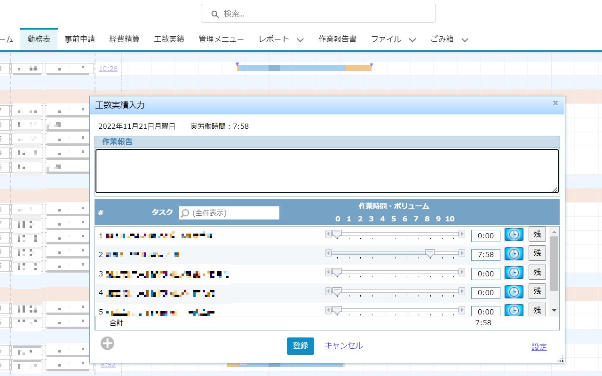

# TeamSpirit Extension

## Features

- 勤務表の工数実績入力に"残"ボタン追加
- 時間フォーカス時に入力しやすく（input type="time"使用）



## Build

```sh
npm install
npm run build
```

distフォルダにmain.***.jsとmanifest.jsonが生成される。

## 拡張機能

`パッケージ化されていない拡張機能を読み込む`でdistフォルダを指定する。

## 開発

```sh
npm start
```

後、Chromeの拡張機能で再読み込みした後は、ソースを修正しても拡張機能の再読み込みは不要。  
ただし、該当画面でのブラウザのリロードは必要。  
`npm start`を終了した場合は`npm run build`を実行して拡張機能を再読み込みする。  
再読み込みしないと拡張機能がWebsocket通信できなくなりエラーになる。
